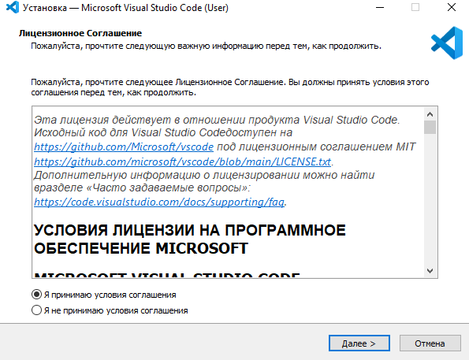
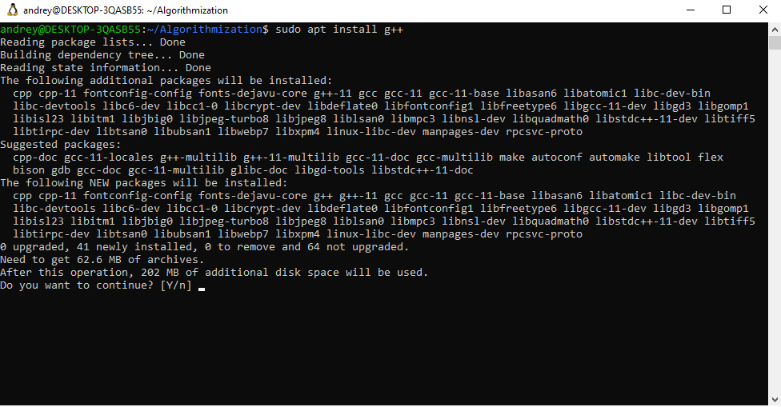
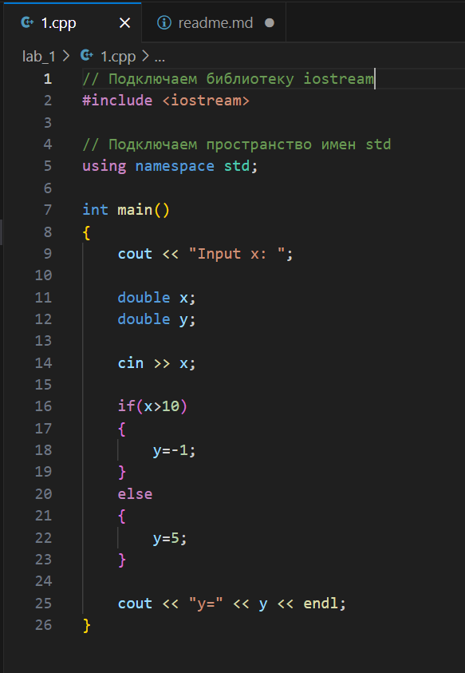
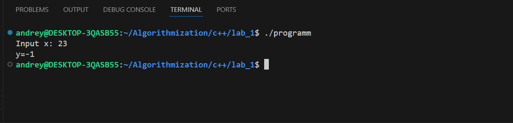

При выполнении лабораторных работ я буду использовать WSL для удобства.

Git уже установлен по умолчанию в дистрибутиве Ubuntu-22.04.

 

Установка VS Code
 

Установка g++
 

Написание простого алгоритма, в котором при вводе х зависит значение у.
 

Вывод работы программы
 
